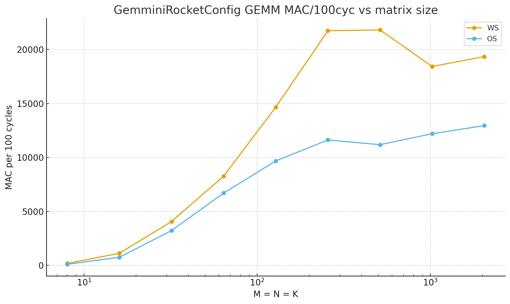
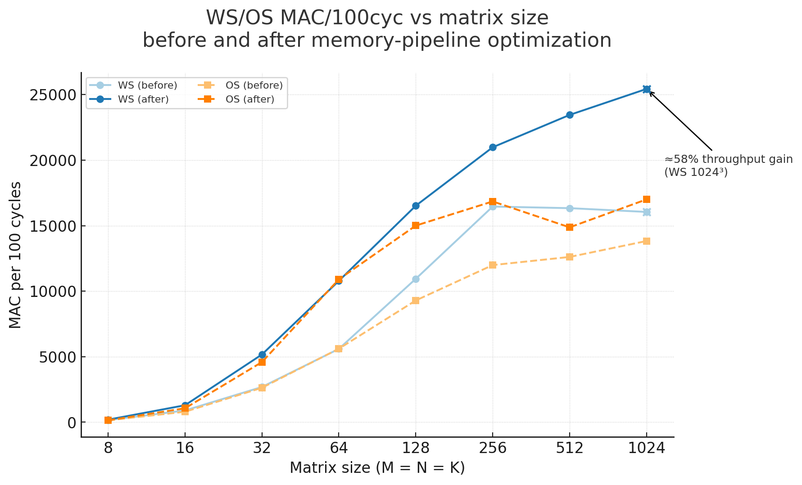
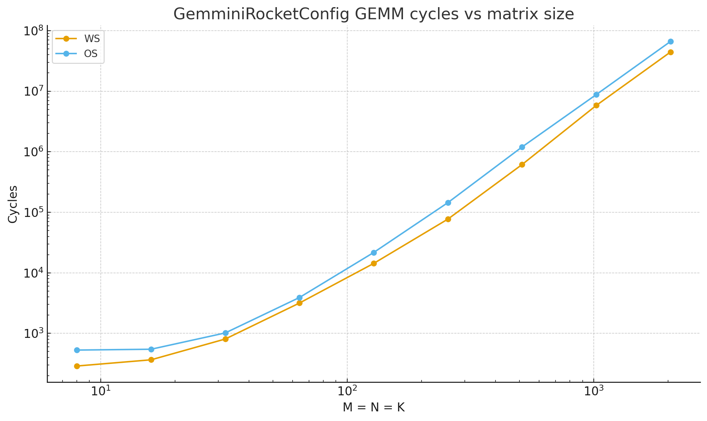
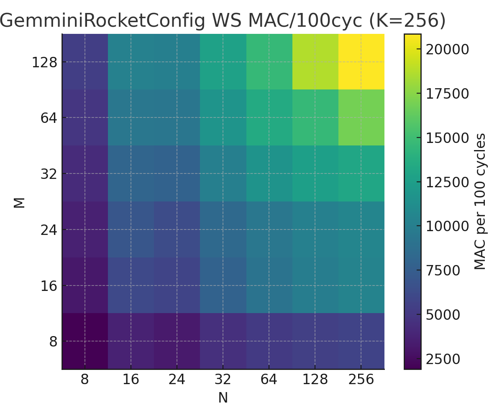
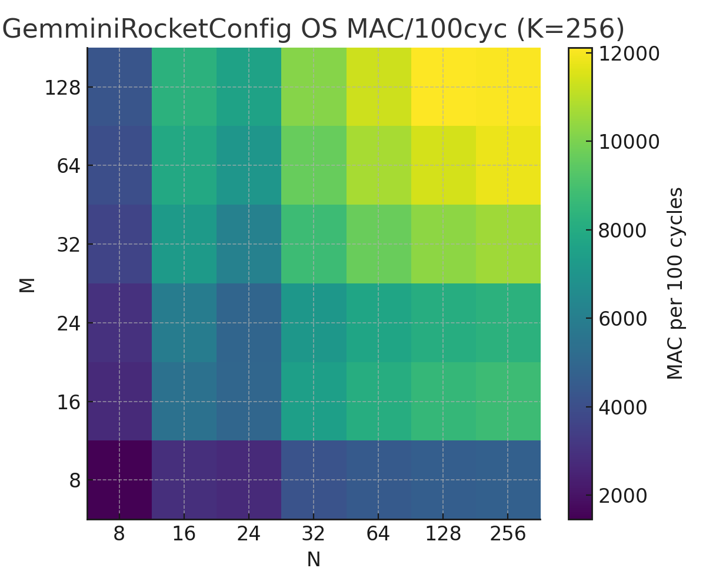

> **Project navigation**
>
> | Branch | Project |
> | --- | --- |
> | [`chipyard_hetero`](https://github.com/younghun-kim-dev/chipyard/tree/chipyard_hetero) | Heterogeneous SoC Memory Contention: Diagnosis & Mitigation |
> | `chipyard_gemmini` | **(this branch)** Gemmini Offload Thresholds and Memory-Centric Pipeline Co-Design |
> | [`chipyard_sha3`](https://github.com/younghun-kim-dev/chipyard/tree/chipyard_sha3) | SHA3 Accelerator Performance Stabilization in Chipyard |

---

# Project Summary

### 1. RocketConfig WS/OS baseline (Rocket + Gemmini)

- Characterizes GEMM WS/OS scaling on a simple Rocket+Gemmini SoC.
- Reveals the transition from **launch/overhead-dominated** to **bandwidth/tiling-limited** regimes; WS is consistently more efficient than OS.

---

### 2. BOOM+Gemmini memory-pipeline optimization (V4 → V43)

- Co-designs Gemmini’s **SPM/ACC banking, system bus width, and DMA width**.
- Raises WS throughput at \(1024^3\) by ≈**58%** (and improves OS as well), showing that the missing speedup was largely in the **memory path**, not the MAC array.

---

### 3. CPU vs Gemmini offload threshold K\* (Boom + Gemmini)

- Builds a CPU vs Gemmini **offload-threshold pipeline** on `GemminiLargeBoomV4Config`.
- Example thresholds: **4×4 → no offload**, **8×8 → K\*=5**, **12×12 → K\*=1**.
- Demonstrates that offloading is **not always beneficial**; K\*(M,N) depends strongly on tile size/shape and memory behavior.

---

## Project – Gemmini Offload Thresholds and Memory-Centric Pipeline Co-Design

Goal: **Understand when matrix-multiplication workloads should be offloaded to Gemmini vs. kept on the CPU, and how memory-path parameters (scratchpad/accumulator banking, bus widths, DMA alignment, dataflow) shift the offload threshold K\* and end-to-end throughput.**

This project has three parts:

1. Baseline WS/OS behavior on a simple Rocket+Gemmini SoC  
2. Memory-pipeline optimization on a BOOM+Gemmini SoC (before vs. after)  
3. CPU vs. Gemmini offload-threshold sweeps (K\* finder)

Raw logs and CSVs live under `sims/verilator/**/` in this repo.  
The tables below are small, high-level summaries.

---

### 1. Baseline: GemminiRocketConfig GEMM (WS vs. OS)

**Question.** For a simple Rocket+Gemmini SoC, how do WS/OS GEMM cycles and throughput scale with matrix size?

**Setup**

- SoC: `GemminiRocketConfig` (Rocket core + Gemmini)
- Benchmark: `ws_os_single-baremetal`
- Workload: GEMM with **M = N = K ∈ {8, 16, 32, 64, 128, 256, 512, 1024, 2048}**
- Dataflows: Gemmini **WS** and **OS**
- Simulator: Verilator + DRAMSim2 (off-chip DRAM timing model)
- Metrics: total **cycles**, **MAC per 100 cycles (MAC/100cyc)**, `sum(C)` for correctness

#### Figures

(Place these PNGs under `figs/`.)

- Both WS and OS follow near-cubic scaling in cycles.
- MAC/100cyc reveals two regimes:
  - **Small matrices (≤ 32)**: dominated by launch + data-movement overheads.
  - **Large matrices (≥ 256)**: MAC/100cyc plateaus → **bandwidth / tiling limits** dominate.
- WS is consistently faster and more efficient than OS at all sizes.

#### Additional WS/OS tile-shape heatmaps (K = 256)

(These heatmaps are derived from the WS/OS sweep results in  
`chipyard_hetero/sims/verilator/out-sweep-20251015-042642/results.csv` in the `chipyard_hetero` branch.)

- Visualizes how **tile shape (M,N)** affects throughput for WS and OS at fixed K=256.
- WS achieves higher MAC/100cyc across the board; near-square tiles are noticeably more efficient than very skinny ones.

#### Summary table (RocketConfig, WS vs OS)

| M = N = K | WS cycles | OS cycles | WS MAC/100cyc | OS MAC/100cyc |
|-----------|-----------|-----------|---------------|---------------|
| 8         |       289 |       530 |           177 |            96 |
| 16        |       366 |       547 |         1,119 |           748 |
| 32        |       807 |     1,017 |         4,060 |         3,222 |
| 64        |     3,172 |     3,914 |         8,264 |         6,697 |
| 128       |    14,298 |    21,670 |        14,667 |         9,677 |
| 256       |    77,157 |   144,406 |        21,744 |        11,618 |
| 512       |   615,096 | 1,199,921 |        21,820 |        11,185 |
| 1024      | 5,825,707 | 8,804,215 |        18,431 |        12,195 |
| 2048      |44,402,692 |66,313,472 |        19,345 |        12,953 |

**Takeaways**

- Even this simple Rocket+Gemmini SoC already shows:
  - clear **overhead-dominated** vs **bandwidth-dominated** regimes, and  
  - **WS > OS** in both latency and MAC utilization.
- These curves serve as a **baseline** for later SoC and memory-path changes.

---

### 2. Memory-Pipeline Optimization: BOOM+Gemmini (before vs after)

**Question.** On a BOOM+Gemmini SoC, how much of the “missing” accelerator performance is due to the **memory path**, and how much can we recover by co-designing SPM/ACC, system bus width, and DMA width?

**Setup**

- SoCs:
  - **before**: `GemminiLargeBoomV4Config`
  - **after**:  `GemminiLargeBoomV43Config`
- Changes implemented as Gemmini/Chipyard **config mixins**:
  - SPM/ACC banking & sizing
  - System bus beat width
  - Gemmini DMA bus-width alignment
- Benchmark: `ws_os_single2-baremetal` (one-shot GEMM)
- Workload: **M = N = K ∈ {8, 16, 32, 64, 128, 256, 512, 1024}**
- Dataflows: WS and OS
- Simulator: Verilator + DRAMSim2, warmup = 1
- Metric: MAC/100cyc (throughput), plus total cycles

#### Figure

(Place under `figs/`.)

- Light colors = **before** (V4), dark colors = **after** (V43)
- Blue = WS, orange = OS
- Arrow highlights ≈ **58% throughput gain for WS at 1024³** (16k → 25k MAC/100cyc).

#### Summary table (selected sizes, MAC/100cyc)

| M = N = K | WS before | WS after | WS gain | OS before | OS after | OS gain |
|-----------|-----------|----------|---------|-----------|----------|---------|
| 256       |   16,457  |  20,981  | ≈+28%   |   11,991  |  16,849  | ≈+40%   |
| 512       |   16,335  |  23,450  | ≈+44%   |   12,613  |  14,871  | ≈+18%   |
| 1024      |   16,047  |  25,433  | **≈+58%** | 13,828  |  17,004  | ≈+23%   |

(Each entry is MAC per 100 cycles.)

**Takeaways**

- **Same MAC array, different memory path**:
  - WS 1024³ improves by ≈**58%** in throughput and ≈**37%** in latency.
  - OS 1024³ still improves by ≈**23%** in throughput.
- This confirms that **Gemmini’s speedups were previously limited by the memory path** (SPM/ACC layout, bus width, DMA alignment), not the compute array.
- The before/after curves provide a clean, visual proof that **memory-centric co-design** pushes GEMM into a higher-throughput plateau.

---

### 3. CPU vs Gemmini Offload Threshold K\* (Boom+Gemmini)

**Question.** For small/medium GEMM tiles on a BOOM+Gemmini SoC, **when** does offloading to Gemmini become faster than running on the CPU?

**Setup**

- SoC: `GemminiLargeBoomV4Config`
- Benchmark: `ws_os_threshold-baremetal`
- Workload:
  - Multiple **(M, N)** tile sizes in `{4, 6, 8, 10, 12}`
  - For each (M, N), sweep **K ∈ {1, …, 8}**
- Comparison: CPU blocked GEMM vs Gemmini (OS dataflow)
- Metrics:
  - `CPU_cyc`, `ACC_cyc`, `speedup = CPU_cyc / ACC_cyc`
  - `Offload` flag (1 if ACC faster, 0 otherwise)
- Define **K\*(M, N)** = smallest K where `Offload = 1`.

#### Summary K\* table

|   M |   N | K* (first K where ACC beats CPU)          |
|-----|-----|-------------------------------------------|
|  4  |  4  | none (CPU faster for all K ≤ 8)          |
|  4  |  8  | 7                                        |
|  4  | 12  | 2                                        |
|  6  |  6  | 8                                        |
|  6  | 10  | 2                                        |
|  8  |  4  | none (CPU faster for all K ≤ 8)          |
|  8  |  8  | 5                                        |
|  8  | 12  | 1                                        |
| 10  |  6  | 6                                        |
| 10  | 10  | 1                                        |
| 12  |  4  | 8                                        |
| 12  |  8  | 5                                        |
| 12  | 12  | 1                                        |

Empirically:

- When `Offload = 1`, the median speedup is ≈**1.7×**, the mean ≈**1.9×**, and the best cases reach ≈**4×** speedup.
- Tiny tiles such as (4,4) and (8,4) never benefit from Gemmini up to K=8 → **launch & data-movement overhead dominate**.
- Near-square, larger tiles such as (10,10) and (12,12) already benefit at K\*=1 → **Gemmini’s setup cost is amortized even for short K**.
- Shape matters: (8,12) has K\*=1 while (12,8) has K\*=5, showing that **loop/blocking order and memory layout strongly affect the offload threshold**.

**Takeaways**

- Offloading is not “always good”: **K\*(M, N)** is a real, measurable quantity.
- The threshold pipeline provides a reusable tool:
  - For any new SoC or Gemmini config, re-running this benchmark shows **how K\*(M, N)** shifts under different memory hierarchies.
  - Combined with the before/after curves, it gives a complete picture of **when and why** accelerator speedups survive integration.

---

## Code / Config Map (where to look in this repo)

Pointers from the high-level story above to concrete code in this fork:

- **SoC configs (Chipyard side)**  
  `generators/chipyard/src/main/scala/config/GemminiBoomV4Configs.scala`  
  BOOM + Rocket + Gemmini configs used for the memory-path experiments.

- **Gemmini memory-pipeline mixins**  
  (file names may differ slightly depending on submodule version)
  - `WithGemminiSpAccTuning.scala` – scratchpad/accumulator tuning (banking, sizing).  
  - `WithSystemBusWidth.scala` – system bus beat-width control.  
  - `WithGemminiDmaBuswidth.scala` – Gemmini DMA bus-width alignment.

- **Benchmarks (Gemmini ROCC tests)**  
  `generators/gemmini/software/gemmini-rocc-tests/`  
  - `ws_os_single-baremetal` – RocketConfig WS/OS sweeps.  
  - `ws_os_single2-baremetal` – BOOM+Gemmini one-shot GEMM (before/after).  
  - `ws_os_threshold-baremetal` – CPU vs Gemmini offload-threshold sweeps.

- **Results and figures**  
  - Verilator run directories under `sims/verilator/**/` store UART logs and CSV summaries.  
  - This README uses compact Markdown tables; full raw CSVs remain in `sims/verilator/...`.  
  - Plots in this README are generated from those CSVs and stored under `figs/`.

This layout lets readers (and admissions committees) quickly map high-level claims in my CV/SOP  
(e.g., “~58% throughput gain at 1024³ after memory-pipeline co-design”)  
to **concrete configs, benchmarks, and measurement scripts** in this repository.
