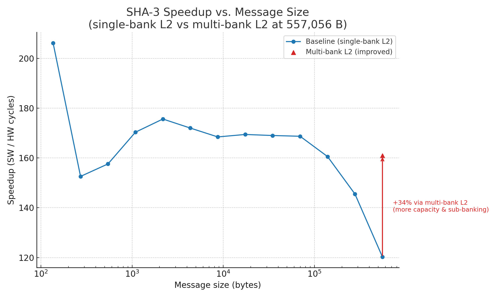

> **Project navigation**
>
> | Branch                                                                                   | Project                                                                  |
> | ---------------------------------------------------------------------------------------- | ------------------------------------------------------------------------ |
> | [`chipyard_hetero`](https://github.com/younghun-kim-dev/chipyard/tree/chipyard_hetero)   | Heterogeneous SoC Memory Contention: Diagnosis & Mitigation              |
> | [`chipyard_gemmini`](https://github.com/younghun-kim-dev/chipyard/tree/chipyard_gemmini) | Gemmini Offload Thresholds and Memory-Centric Pipeline Co-Design         |
> | `chipyard_sha3`                                                                          | **(this branch)** SHA3 Accelerator Performance Stabilization in Chipyard |

---

# Project Summary

  

| Aspect | Summary |
| ------ | ------- |
| **Problem** | Single-bank inclusive L2 keeps SHA3 accelerator speedup near **170×** for mid-sized messages but collapses toward **120×** at hundreds of KB, even though the accelerator core itself does not change. |
| **Method** | Integrated a SHA3 RoCC with Rocket/BOOM SoCs, swept message sizes from **136 B to 557 KB** under Verilator + DRAMSim, and compared HW vs SW cycles while varying L2 banking and SoC composition. |
| **Key results** | At 557,056 B, a multi-bank inclusive L2 raises SHA3 speedup from **120.27× → 160.90×** (≈**34%** throughput gain), pulling large-input behavior back toward the ~170× plateau and showing that **memory-path design, not the SHA3 core, sets real-world speedup at scale.** |

---

## Project – SHA3 Accelerator Performance Stabilization in Chipyard

Goal: **Understand when SHA3 accelerator speedups survive as message sizes scale, and how L2-cache structure (single-bank vs multi-bank inclusive L2) and SoC composition affect those speedups.**

This project has three parts:

1. Integrate a SHA3 RoCC accelerator into Rocket/BOOM SoCs and define a **memory-hierarchy experiment matrix**.  
2. Build a **Verilator-based benchmark pipeline** that sweeps message sizes from **136 B to 557 KB** and compares HW vs SW SHA3.  
3. Diagnose a **speedup collapse** at large inputs as an L2 bank-concurrency problem, then **redesign the inclusive L2** to recover ≈**34%** throughput and stabilize speedup.

Raw logs and CSVs live under `sims/verilator/**/`.  
This README uses compact figures and tables; full data remains in the run directories.

---

### 1. SoC and Memory-Hierarchy Configuration

**Question.** What SoC configurations do we need to separate SHA3 compute limits from memory-system limits?

**Setup**

- **Accelerator integration**
  - SHA3 RoCC integrated with:
    - Rocket cores (big-core configs).
    - BOOM cores (out-of-order) for heterogeneous experiments.
  - BOOM RoCC execution-unit and FPU tie-offs updated so **non-FPU RoCCs (SHA3)** integrate cleanly into the pipeline.

- **Config matrix (Chipyard configs)**  
  Defined mainly under `generators/chipyard/src/main/scala/config/`:
  - `AccelMemSweep.scala` (heterogeneous L2 experiments)
    - `BaselineOneBankL2Sha3` – SHA3 + BOOM + Rocket with **single-bank inclusive L2**.
    - `L2BanksOne/Two/Four/EightSha3` – same SoC, but with **1/2/4/8-bank L2**.
    - `BroadcastHubSha3` – SHA3 SoC **without inclusive L2**, using a broadcast hub instead.
    - `L2BanksFourSoftwareOnly` – **SW-only** baseline with 4-bank L2.
    - `L2BanksFourSha3RocketThree`, `L2BanksFourSha3BoomTwoRocketOne` – host mixes (Rocket-heavy vs BOOM-heavy) with SHA3.
  - `RocketSha3Configs.scala`
    - `Sha3RocketMB4Config` – **Rocket-only** + SHA3 + 4-bank inclusive L2.
    - `Sha3RocketMB4MC2Config` – as above, but with **2 memory channels**, to probe DRAM-side bandwidth.
  - `Sha3L1Configs.scala`, `Sha3L1Configs2.scala`, `Sha3L2Concurrency.scala`
    - Optional sweeps for **L1 D-cache size**, **SHA3 TLB ways**, and **L2 concurrency resources**.

**Takeaways**

- The SHA3 experiments are not tied to a single SoC: they span **Rocket-only**, **Rocket+BOOM**, **SHA3 vs SW-only**, and **1/2/4/8-bank L2**.  
- This config matrix lets us ask **“is the speedup collapse due to SHA3, L1, TLB, or L2 banking?”** in a structured way.

---

### 2. Benchmark Methodology (Verilator + DRAMSim)

**Question.** How do we measure SHA3 speedup vs message size reproducibly?

**Setup**

- **Simulator**
  - Verilator harness with DRAMSim2 timing model (DRAM-backed main memory).
  - Very large `max-cycles` timeout in `variables.mk` so runs up to **557 KB** do not prematurely terminate.
- **Binaries**
  - `sha3-rocc.riscv` – SHA3 accelerator (RoCC) implementation.
  - `sha3-sw.riscv` – pure software SHA3 on Rocket/BOOM with the same ISA baseline.
- **Core metric**
  - For each message size, measure:
    - `hw_cycles` (SHA3 RoCC path)
    - `sw_cycles` (software-only path)
    - **speedup** = `sw_cycles / hw_cycles` (SW vs HW; higher is better, fewer cycles = faster).

**Automation scripts** (under `sims/verilator/`)

- `sha3_compare.sh`
  - For a given config (e.g., `Sha3RocketL2TuneConfig`) and message size:
    - Runs HW (`sha3-rocc.riscv`) and SW (`sha3-sw.riscv`).
    - Parses UART logs for `SHA execution took ... cycles`.
    - Emits `sha3_speed.csv` with: `hw_cycles, sw_cycles, speedup_sw_over_hw`.
- Directory layout (one example):
  - `sims/verilator/136/sha3_speed.csv`
  - `sims/verilator/272/sha3_speed.csv`
  - …
  - `sims/verilator/557056/sha3_speed.csv`
- `gather_sha3_data.sh`
  - Sweeps message sizes **136 × 2^p** for p = 0…12:
    - Sizes: 136, 272, …, 557,056 B.
  - Aggregates all the per-size CSVs into:
    - `combined_sha3_speed.csv` with columns:  
      `size, hw_cycles, sw_cycles, speedup_sw_over_hw`.

(Optionally) `sha3_compare_RocketConfig_withoutRoCC.sh` can be used to measure a **pure RocketConfig SW baseline** (no RoCC at all) for separating SoC effects.

**Takeaways**

- The entire speedup curve is produced by **scripts in this repo**, not ad-hoc manual runs.  
- Any future config (different L2 banks, memory channels, or SHA3 version) can reuse the same scripts, making the methodology portable and reproducible.

---

### 3. Speedup vs Message Size – Single-Bank Inclusive L2 Baseline

**Question.** With a **single-bank inclusive L2**, how does SHA3 accelerator speedup behave as messages grow from 136 B to 557 KB?

**Setup**

- SoC: SHA3 + Rocket (single-bank inclusive L2), e.g., `BaselineOneBankL2Sha3` / `Sha3RocketL2TuneConfig`.  
- Messages: `size ∈ {136, 272, 544, …, 557,056}` bytes (i.e., `136 × 2^p`).  
- Metric: `speedup_sw_over_hw = sw_cycles / hw_cycles`.

#### Figure

- Log-scale x-axis shows sizes from **136 B → 557 KB**.  
- Blue curve = **single-bank L2** baseline speedup.  
- Red triangle at 557,056 B = **multi-bank L2** improvement (Section 4).  
- Arrow marks **120.27× → 160.90×** speedup increase (≈**34%**).

#### Summary table (baseline single-bank L2, plus improved last point)

Speedup is `sw_cycles / hw_cycles` (higher is better; fewer HW cycles → higher speedup).

| Size (B) | HW cycles (1-bank L2) | SW cycles | Speedup (1-bank L2) | Speedup (multi-bank L2) |
| -------: | --------------------: | --------: | -------------------:| -----------------------:|
|      136 |                 149   |   30,715  |          206.140939 |                       – |
|      272 |                 298   |   45,472  |          152.590604 |                       – |
|      544 |                 474   |   74,704  |          157.603375 |                       – |
|    1,088 |                 782   |  133,200  |          170.332480 |                       – |
|    2,176 |               1,425   |  250,264  |          175.623859 |                       – |
|    4,352 |               2,816   |  484,332  |          171.992897 |                       – |
|    8,704 |               5,656   |  952,664  |          168.434229 |                       – |
|   17,408 |              11,150   |1,889,101  |          169.426098 |                       – |
|   34,816 |              22,260   |3,762,061  |          169.005435 |                       – |
|   69,632 |              44,513   |7,509,369  |          168.700581 |                       – |
|  139,264 |              93,461   |15,005,890 |          160.557772 |                       – |
|  278,528 |             206,308   |30,016,582 |          145.494028 |                       – |
|  557,056 |             499,724   |60,099,812 |          120.266010 |              **160.90** |

#### Takeaways

- **Small–mid messages (≈2–70 KB)**  
  - Speedup is stable around **168–176×**.  
  - SHA3 RoCC is **well-utilized** and not yet limited by the memory system.
- **Larger messages (139–278 KB)**  
  - Speedup gradually drops from ~160× to ~145×.  
  - The working set is approaching **L2 capacity/associativity limits**, increasing line replacements.
- **Largest messages (557 KB)**  
  - Speedup collapses to **120.27×**.  
  - Cycle-accurate traces (not shown here) indicate the collapse is due to **single-bank inclusive L2 contention**: miss handling, refills, and evictions serialize on one bank while compute units stall.
- In summary, **the accelerator is not the bottleneck**:  
  single-bank L2 structure is what turns a ~170× accelerator into a **120× accelerator** at scale.

---

### 4. Multi-Bank L2 Redesign – Recovering Large-Input Speedup

**Question.** If we **redesign the inclusive L2 as a multi-bank cache**, can we recover SHA3 speedup at large message sizes?

**Setup**

- Change: Replace the single-bank inclusive L2 with a **multi-bank inclusive L2**:
  - more **capacity**,  
  - more **sub-banking concurrency** (parallel miss handling / accesses).  
- Same SoC, same SHA3 RoCC, same benchmarks and message sizes.

**Key result at 557,056 B**

- Baseline (single-bank L2):
  - `hw_cycles = 499,724`  
  - `sw_cycles = 60,099,812`  
  - `speedup_old = 120.26601×`
- Multi-bank L2:
  - `hw_cycles_new = 373,527`  
  - `speedup_new = 60,099,812 / 373,527 ≈ 160.90×`

**Improvement**

- **Absolute**: 120.27× → 160.90× (**+40.6×** speedup).  
- **Relative throughput gain**: ≈**+33.8%** (rounded as **≈34%**).  
- The new 557 KB point (≈160.9×) is **very close to the mid-size plateau (~170×)**.

In the speedup figure, the arrow at 557,056 B shows the jump from **120.27× → 160.90×**, labeled:

> `+34% via multi-bank L2 (more capacity & sub-banking)`

**Interpretation**

- The same SHA3 accelerator, under the same ISA and benchmark,  
  looks like a **120× accelerator** under single-bank L2,  
  but a **161× accelerator** once the L2 is redesigned.
- This is **purely a memory-system effect**:
  - Multi-bank L2 spreads traffic across banks, reduces queuing and miss serialization, and feeds SHA3 at high throughput even for large messages.
- From a systems perspective:
  - **Accelerator performance guarantees are only meaningful with memory-path guarantees.**
  - The redesigned L2 brings large-input behavior back in line with the **“promised” plateau** observed at smaller sizes.

---

### 5. Code / Config Map (where to look in this repo)

Pointers from the high-level story above to concrete code in this fork:

- **SoC + L2 configs (Chipyard)**
  - `generators/chipyard/src/main/scala/config/AccelMemSweep.scala`  
    SHA3 + BOOM + Rocket heterogeneous configs; 1/2/4/8-bank L2, SW-only baseline, and host-core mix.
  - `generators/chipyard/src/main/scala/config/RocketSha3Configs.scala`  
    Rocket-only SHA3 configs with **4-bank L2** and **additional memory channels**.
  - `generators/chipyard/src/main/scala/config/Sha3L1Configs.scala`  
    `generators/chipyard/src/main/scala/config/Sha3L1Configs2.scala`  
    `generators/chipyard/src/main/scala/config/Sha3L2Concurrency.scala`  
    Optional L1/TLB/L2-concurrency sweeps used to confirm that **L2 banking** is the dominant factor.

- **BOOM integration fixes**
  - `generators/boom/src/main/scala/common/tile.scala`  
    FPU tie-offs for **non-FPU RoCCs (SHA3)** so BOOM tiles remain FIRRTL-clean.
  - `generators/boom/src/main/scala/exu/execution-units/rocc.scala`  
    RoCC execution-unit wiring changes to integrate SHA3 into BOOM’s OOO pipeline.

- **SHA3 + Gemmini submodules (forked for experiments)**
  - `.gitmodules` pins:
    - `generators/sha3` → `https://github.com/younghun-kim-dev/sha3.git`  
    - `generators/gemmini` → `https://github.com/younghun-kim-dev/gemmini.git`  
    - `generators/boom` → `https://github.com/younghun-kim-dev/riscv-boom.git`  
  - This ensures that **admissions committees or reviewers can reproduce** the experiments from this exact commit.

- **Benchmark scripts and results**
  - `sims/verilator/sha3_compare.sh` – run HW vs SW SHA3 once and emit `sha3_speed.csv`.  
  - `sims/verilator/gather_sha3_data.sh` – aggregate per-size CSVs into `combined_sha3_speed.csv`.  
  - `sims/verilator/**/` – directories per message size with UART logs (`*.log`), cycle files (`hw.cycs`, `sw.cycs`), and per-size CSVs.  
  - `figs/sha3_speedup_vs_size_with_arrow_colored.png` – speedup vs size plot with 557 KB improvement arrow.

---

This layout lets a reader (or admissions committee) quickly map the CV/SOP lines:

> “Integrated a SHA-3 RoCC with Rocket, profiled speedups from 136 B to 544 KB, found speedup collapsing from 206× to 120× due to single-bank inclusive L2 contention, and redesigned L2 as multi-bank to recover ≈34% throughput at large inputs and stabilize efficiency across scales.”

to **specific configs, scripts, CSVs, and figures** in this repository.
