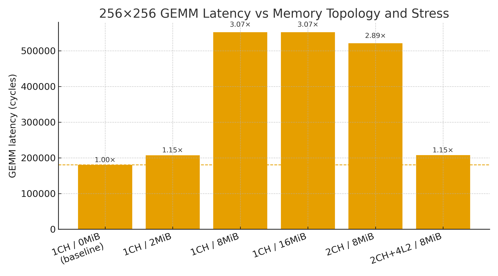
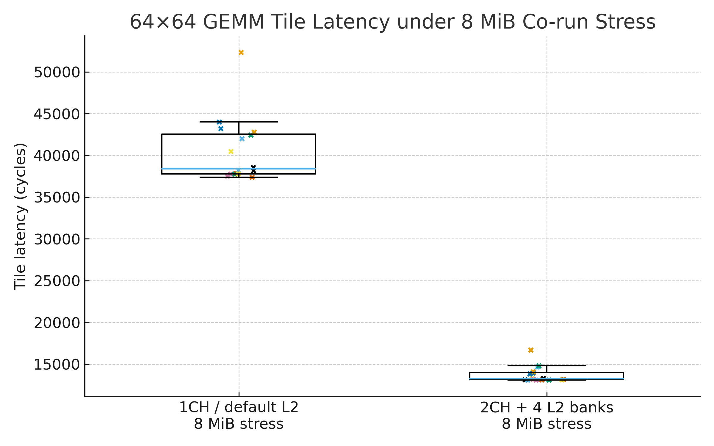

> **Project navigation**
>
> | Branch                                                                                   | Project                                                                       |
> | ---------------------------------------------------------------------------------------- | ----------------------------------------------------------------------------- |
> | `chipyard_hetero`                                                                        | **(this branch)** Heterogeneous SoC Memory Contention: Diagnosis & Mitigation |
> | [`chipyard_gemmini`](https://github.com/younghun-kim-dev/chipyard/tree/chipyard_gemmini) | Gemmini Offload Thresholds and Memory-Centric Pipeline Co-Design              |
> | [`chipyard_sha3`](https://github.com/younghun-kim-dev/chipyard/tree/chipyard_sha3)       | SHA3 Accelerator Performance Stabilization in Chipyard                        |

---

# Project Summary

  

| Aspect          | Summary                                                                                                                                                                                                                                                                                                                                                                                           |
| --------------- | ------------------------------------------------------------------------------------------------------------------------------------------------------------------------------------------------------------------------------------------------------------------------------------------------------------------------------------------------------------------------------------------------- |
| **Problem**     | When a BOOM+Gemmini accelerator shares a single-channel DRAM + monolithic L2 with two Rocket cores, **co-run memory contention can slow a 256×256 GEMM by ≈3×**, even though the Gemmini compute array itself is unchanged.                                                                                                                                                                       |
| **Method**      | Built a **heterogeneous co-run profiling framework** on a RISC-V SoC (BOOM + 2×Rocket + Gemmini) with a configurable DRAM/L2 topology. Ran a Gemmini GEMM (256×256×256) concurrently with two Rocket linear bandwidth stressors, sweeping stress sizes and memory configurations while logging **cycle-accurate per-hart/tile timing**.                                                           |
| **Key results** | Under 8 MiB co-run stress, a single-channel, default L2 design slows Gemmini by **3.07×**. DRAM **channels alone** only modestly help. Adding **2 channels + 4 L2 banks** and retuning the memory controller recovers Gemmini latency from **552,077 → 207,392 cycles (~2.7× improvement)** and pulls 64×64 tile latencies into a **tight, predictable band** (≈3× faster and far less variable). |

---

## Project – Heterogeneous SoC Memory Contention: Diagnosis & Mitigation

Goal: **Understand how shared-memory contention shapes accelerator behavior when workloads co-run on a RISC-V SoC, and how memory topology (channels, L2 banking) and scheduling can restore predictable speedups.**

This project has three parts:

1. **Co-run profiling framework** on a heterogeneous RISC-V SoC (BOOM + 2×Rocket + Gemmini).
2. **One-shot GEMM stress sweeps** across DRAM/L2 configurations (1CH vs 2CH, default vs multi-bank L2).
3. **Tile-level analysis** of Gemmini 64×64 subtiles under contention to quantify latency **predictability**, not just average throughput.

Raw logs live under `sims/verilator/**/` in this repo.
This README uses compact figures and tables; full UART logs and cycle dumps remain in the run directories.

---

### 1. Heterogeneous SoC and Co-Run Profiling Framework

**Question.** How do we reproduce, control, and measure shared-memory contention between CPU cores and a Gemmini accelerator on the same SoC?

**Setup**

* **SoC topology (Chipyard configs)**
  All experiments use a BOOM + 2×Rocket + Gemmini SoC, with variants such as:

  * `GemminiLargeBoomV4Rocket2Config` – 1 DRAM channel, default L2.
  * `GemminiLargeBoomV4Rocket22CHConfig` – **2 DRAM channels**, default L2.
  * `GemminiLargeBoomV4Rocket22CHL24BanksConfig` – **2 DRAM channels + 4-bank L2**, tuned memory controller.
  * (Exact filenames may differ slightly by commit; look for `GemminiLargeBoomV4Rocket2*` configs under `generators/chipyard/src/main/scala/config/`.)

* **Cores / harts**

  * Hart 0 – **Rocket#1**: memory bandwidth stressor.
  * Hart 1 – **Rocket#2**: independent memory bandwidth stressor.
  * Hart 2 – **BOOM**: Gemmini host (runs GEMM kernels).

* **Co-run benchmark binaries**

  * `hetero_gemm_bwtest-baremetal`

    * One-shot Gemmini GEMM (256×256×256).
    * Two Rocket linear “mem-stress” loops.
    * Prints per-hart start/finish and Gemmini GEMM cycles.
  * `hetero_gemm_bwtest2-baremetal`

    * Same co-run setup, but **GEMM split into 16× 64×64 tiles**.
    * Logs per-tile latency:
      `"[tile i=0 j=0] im=64 jn=64 -> cycles=..."`.

* **Memory stressors**

  * Each Rocket runs a linear stream:
    `stress = {2, 8, 16} MiB`, `stride = 64`, `passes = 1`.
  * Output looks like:
    `stress=8 MiB, stride=64, passes=1 -> cycles=2618658`.

* **Simulator**

  * Verilator harness with DRAMSim2 (`+dramsim`) for realistic main-memory timing.
  * Very large `+max-cycles` to avoid premature termination under heavy stress.

**Takeaways**

* This framework lets us **dial contention up and down** (via stress size and topology) while recording:

  * per-hart completion cycles, and
  * per-tile Gemmini latencies.
* It provides a reusable way to ask:
  **“When do accelerator speedups survive co-run contention, and when do they collapse?”**

---

### 2. One-Shot GEMM under Co-Run Memory Stress

**Question.** For a 256×256×256 Gemmini GEMM co-running with two Rocket bandwidth stressors, how do different DRAM/L2 topologies affect end-to-end latency?

#### Setup (one-shot GEMM runs)

* **GEMM workload**: 256×256 × 256×256, Gemmini WS-style kernel.
* **Co-run stress**: two Rocket harts, each streaming **2, 8, or 16 MiB** linearly from DRAM (stride 64).
* **Metrics**:

  * Gemmini GEMM cycles from UART log:
    `[BOOM GEMM] GEMM 256x256 * 256x256 -> cycles=...`
  * Slowdown vs **no-stress baseline**.

#### Summary table – one-shot GEMM latency

Speedups are shown as **slowdown vs baseline** (higher = worse). Baseline is `GemminiLargeBoomV4Rocket2Config` with almost no co-run stress.

| Config                          | Stress per Rocket | GEMM cycles |                 Slowdown vs baseline |
| ------------------------------- | ----------------- | ----------: | -----------------------------------: |
| 1CH, default L2 (baseline)      | ≈0 MiB            |     180,096 |                                1.00× |
| 1CH, default L2                 | 2 MiB             |     207,074 |                                1.15× |
| 1CH, default L2                 | 8 MiB             |     552,077 |                                3.07× |
| 1CH, default L2                 | 16 MiB            |     552,077 |                    3.07× (saturated) |
| 2CH, default L2                 | 8 MiB             |     521,146 |                                2.89× |
| **2CH + 4 L2 banks (tuned MC)** | **8 MiB**         | **207,392** | **1.15× (~2.7× better vs 1CH/8MiB)** |

* Baseline (≈180k cycles) is essentially Gemmini running alone.
* With a **single DRAM channel and default L2**, 8–16 MiB co-run stress pushes GEMM to **≈552k cycles (3.07× slowdown)** and **additional stress no longer changes latency** → DRAM/L2 are fully bandwidth-limited.
* Adding a **second DRAM channel alone** helps only slightly (≈2.89× slowdown).
* Combining **2 channels + 4 L2 banks + memory-controller tuning** pulls the 8 MiB run **back to ~207k cycles**, almost matching the low-stress 2 MiB case (1.15× slowdown).

#### Figure – GEMM latency vs topology and stress

(Place this PNG under `figs/`.)

  

* x-axis: `(Config / stress)` pairs.
* y-axis: `256×256 GEMM latency (cycles)`.
* Each bar is annotated with slowdown vs baseline (`1.00×`, `3.07×`, etc.).

**Takeaways**

* **Shared-memory contention alone** (no change to Gemmini array) can turn a 256×256 GEMM from **180k → 552k cycles (~3× slower)**.
* **DRAM channels without L2 changes** are not enough; co-run traffic still fights through a narrow shared path.
* **2CH + 4-bank L2 + tuned controller** recovers **≈2.7× throughput under the same 8 MiB co-run stress**, showing that:

  * real accelerator behavior is dominated by **memory topology and contention**, not raw compute.

---

### 3. Tile-Level Behavior and Predictable Performance Bands

**Question.** Under the same 8 MiB co-run stress, how do different memory topologies affect **per-tile Gemmini latency and its variability**?

To answer this, `hetero_gemm_bwtest2-baremetal` splits the 256×256 GEMM into **16 tiles of 64×64**, logs per-tile cycles, and runs under the same three-hart co-run setup.

#### Setup (tile-level runs)

* **Configs compared**

  * `GemminiLargeBoomV4Rocket2Config` – 1CH, default L2.
  * `GemminiLargeBoomV4Rocket22CHL24BanksConfig` – 2CH + 4-bank L2 (tuned MC).
* **Stress**: 8 MiB per Rocket (same as the “worst” one-shot case).
* **Metric**: each tile line:
  `"[tile i=0 j=0] im=64 jn=64 -> cycles=..."`.

From the logs:

* **1CH, default L2 (8 MiB stress)**

  * Tile latencies (16 tiles):
    `52,327, 42,007, 42,446, 40,489, 44,006, 37,848, …, 37,520, 38,180`
  * Mean ≈ **40,519 cycles**, std-dev ≈ **3,817 cycles**.
* **2CH + 4 L2 banks (8 MiB stress)**

  * Tile latencies:
    `16,716, 14,675, 14,836, 13,280, 13,978, 13,168, …, 13,211, 13,318`
  * Mean ≈ **13,745 cycles**, std-dev ≈ **948 cycles**.

So, under identical 8 MiB stress:

* **Average tile latency** improves by ≈ **2.95×** (40.5k → 13.7k).
* **Variability** shrinks by ≈ **4×** (std-dev 3.8k → 0.95k).

#### Figure – tile latency distributions (1CH vs 2CH+4L2)

(Place this PNG under `figs/`.)

  

* x-axis:

  * `1CH / default L2 / 8 MiB stress`
  * `2CH + 4 L2 banks / 8 MiB stress`
* y-axis: `64×64 tile latency (cycles)`.
* Each box shows the distribution of 16 tile latencies for that config; points are individual tiles.

**Takeaways**

* With **1CH + default L2**, tile latencies are:

  * **slow** (~40k cycles/tile) and
  * **jittery** (large spread, first tile up at 52k).
* With **2CH + 4-bank L2**, tile latencies are:

  * **fast** (~13.7k cycles/tile) and
  * **tightly clustered** (all tiles within a narrow band).

This figure shows that the tuned memory topology does more than raise average throughput—it keeps accelerator performance in a **tight, predictable band**, even under strong co-run contention.
That directly supports the broader research goal: **accelerators that keep their promises under shared-memory constraints.**

---

## Code / Config Map (where to look in this repo)

Pointers from this high-level story to concrete code and logs in the `chipyard_hetero` branch:

* **SoC + memory configs (Chipyard)**

  * `generators/chipyard/src/main/scala/config/`

    * Look for configs named like:

      * `GemminiLargeBoomV4Rocket2Config`
      * `GemminiLargeBoomV4Rocket22CHConfig`
      * `GemminiLargeBoomV4Rocket22CHL24BanksConfig`
    * These set the **BOOM+Rocket+Gemmini topology**, DRAM channel count, and L2 banking.
  * Additional mixins (names may vary slightly by commit) define:

    * DRAM channel count (1CH vs 2CH).
    * L2 bank count (1 vs 4).
    * Memory-controller parameters used in the tuned config.

* **Co-run benchmarks (Gemmini ROCC tests)**

  * `generators/gemmini/software/gemmini-rocc-tests/`

    * `hetero_gemm_bwtest.c`

      * Implements the **one-shot 256×256 GEMM + 2×Rocket mem-stress** experiment.
      * Prints hart start/finish and `[BOOM GEMM] GEMM ... -> cycles=...`.
    * `hetero_gemm_bwtest2.c`

      * Same co-run setup, but logs **16 tile latencies** for 64×64 sub-GEMMs.
  * Built binaries:

    * `build/bareMetalC/hetero_gemm_bwtest-baremetal`
    * `build/bareMetalC/hetero_gemm_bwtest2-baremetal`

* **Verilator runs & logs**

  * `sims/verilator/output/chipyard.harness.TestHarness.GemminiLargeBoomV4Rocket2Config/hetero_gemm_bwtest-baremetal.log`

    * 1CH, default L2 runs (baseline, 2/8/16 MiB stress).
  * `sims/verilator/output/chipyard.harness.TestHarness.GemminiLargeBoomV4Rocket22CHConfig/hetero_gemm_bwtest-baremetal.log`

    * 2CH, default L2 runs.
  * `sims/verilator/output/chipyard.harness.TestHarness.GemminiLargeBoomV4Rocket22CHL24BanksConfig/hetero_gemm_bwtest-baremetal.log`

    * 2CH + 4-bank L2 tuned runs (2.7× recovery).
  * `sims/verilator/output/chipyard.harness.TestHarness.GemminiLargeBoomV4Rocket2*/hetero_gemm_bwtest2-baremetal.log`

    * Tile-level logs (16× tile latencies) for both 1CH and 2CH+4L2 configs.

* **Figures and tables**

  * `figs/fig1_gemm_latency.png`

    * Generated from one-shot GEMM logs; used in the Project Summary and Section 2.
  * `figs/fig2_tile_latency.png`

    * Generated from tile-level logs (`hetero_gemm_bwtest2`); used in Section 3.
  * The latency/speeddown table in Section 2 can be kept directly in this README as Markdown;
    raw numbers come from the UART logs above.

---

This layout lets a reader (or admissions committee) quickly map the CV/SOP line:

> “Investigated how shared-memory contention shapes accelerator behavior on a BOOM–Rocket–Gemmini SoC, built a co-run profiling framework with cycle-accurate logging, diagnosed ~3× slowdowns from DRAM/L2 contention, and recovered up to 2.7× throughput via 2-channel, 4-bank L2 memory-path tuning that keeps accelerator performance in a tight, predictable band.”

to **specific configs, binaries, logs, and figures** in this branch.
